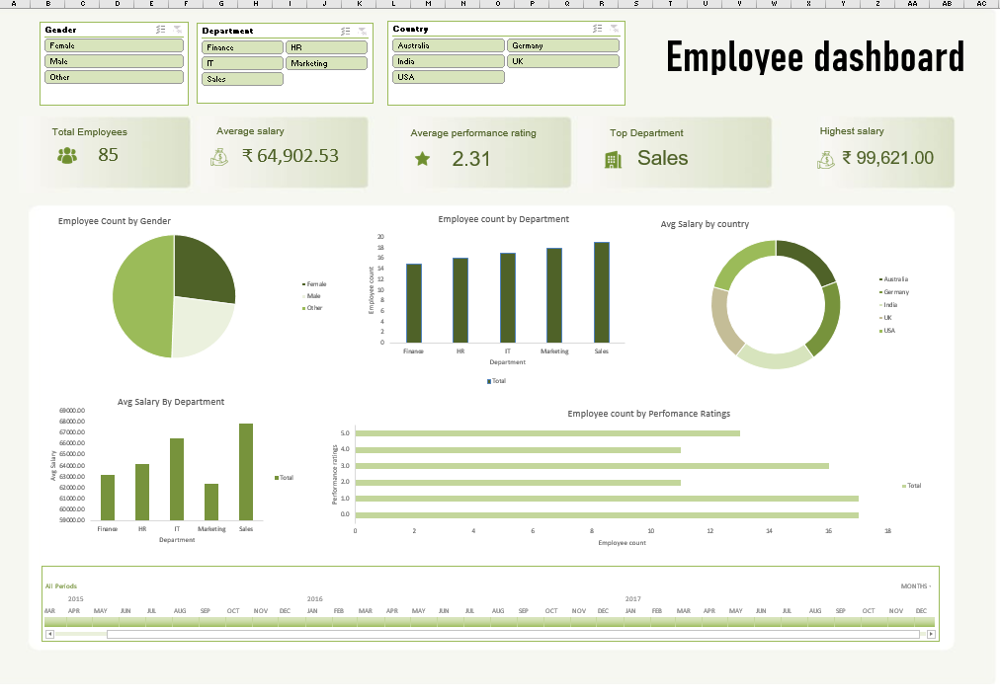

# Employee Analytics Excel Dashboard

HR analytics dashboard built using Excel to visualize key KPIs such as employee count, average salary, and performance ratings for data-driven insights.

---

## Dashboard Preview

---

## Features

- Employee Count Analysis
- Department-wise Insights
- Salary Distribution
- Performance Rating Analysis
- Interactive Slicers
- KPI Cards

---

## Tools Used

- Microsoft Excel
- Pivot Tables
- Pivot Charts
- Slicers
- Conditional Formatting
- Power Query

---

## File Included

- Employee_Dashboard.xlsx

---

## How to Use

1. Download the Excel file
2. Open in Microsoft Excel
3. Enable Editing
4. Use slicers and charts interactively

---

## Author

Shiyam T
